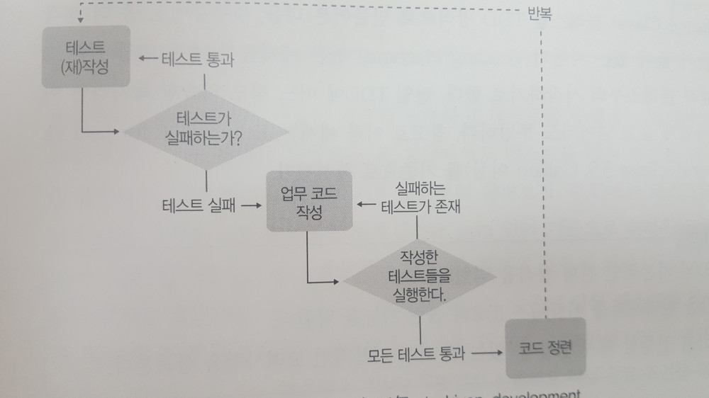

# TDD 실천법과 도구

##테스트 주도 개발

~~헤어지자는 여자친구의 한마디가 머리속에서 for문을 돌며 예외를 연달아 내고 있따~~

개발자의 주관적인 판단에 의한 개발을 '우연에 의존한 코딩'이라고 한다.

회귀테스트가 희귀테스트가 된 개발.

* 회귀테스트(regression test) : 완성된 모듈에 수정을 가할때, 연관된 다른 부분도 정상적으로 동작하는지 확인하기 위해 수행하는 테스트

은탄환은 없다

->그럼에도 확률을 낮추기 위해 XP에서 유래된 TDD가 탄생했다.

> TDD : 프로그램을 작성하기 전에 테스트를 먼저 작성하는 것

프로그램을 작성할 떄 **작성 종료 조건을 먼저 정해놓고 코딩을 시작하는 것**

문서로 만들어 머리로 생각하고 눈으로 확인할 것인가? vs

예상결과를 코드로 표현해놓고 해당 코드가 자동으로 판단하게 할 것인가?

> 테스트 주도 개발의 진행 방식
>
> 질문 -> 응답 -> 정제(리팩토링) -> 반복

질문 : 구현해야 할 기능을 파악하고, 목록을 작성한다.

->작성하고자 하는 메소드나 기능이 무엇인지 선별하고 작성 완료 조건을 정해서 실패하는 테스트 케이스를 작성하는 것

*동작(메소드)를 먼저 정하고 그 동작에 필요한 속성(멤버 변수)를 고려한다*

## JUnit 과 Hamcrest

