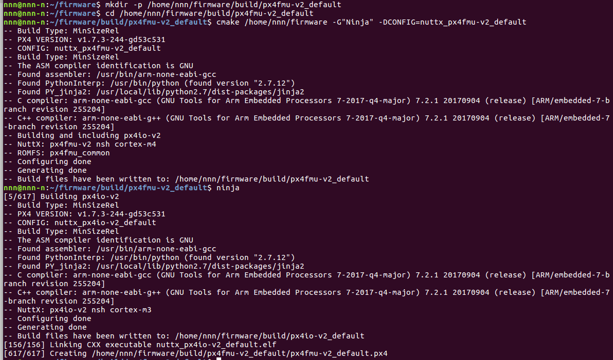

# px4 빌드 시스템 분석

시작은 px4 홈페이지의 어플리케이션 작성에서 역추적해 들어갔다. 어플리케이션의 생성은 [어플리케이션 작성하기](https://dev.px4.io/kr/tutorials/tutorial_hello_sky.html) 페이지를 참조해라. 해당 링크의 설명을 보면,

>1. ```sh
>   git submodule init
>   git submodule update --recursive
>   ```
>
>2. ```sh
>   make px4fmu-v2_default
>   ```

의 두 단계로 이루어진다. 첫번째 명령은 추가적인 submodule을 설치하는 것이고, 두번째가 make를 이용하여 빌드를 한다. 빌드 시스템을 이해하기 위해서는 두 번째 명령부터 역추적해야 할 것이다.


## 개요

(참고 :[Firmware Download](https://github.com/px4/Firmware) )

역추적한 결과 전체적인 내용은 이러하다.

1. `make`명령어로 인자(빌드할 펌웨어 종류)를 받는다.`/Firmware/Makefile`에 명시된 내용으로 실행된다. 넣어줄 인자는 `px4fmu-v2_default` 이다.
2. `Makefile`내에서 `cmake`명령어를 실행시킨다. `/Firmware/CMakeList.txt`에 지정된 내용으로 출력된다.
   * `cmake /home/nnn/바탕화면/src/Firmware -G"Ninja" -DCONFIG=nuttx_px4fmu-v2_default`형식으로 인자값이 주어진다.
3. `Ninja`를 이용해 빌드한다. ninja는 빌드 도구일 뿐이므로 2.까지만 분석하면 될 것이다.


## MAKEFILE

간단한 내용은 코드 내에 한글로 주석(//을 이용해 표시)을 달았다.

`cmake`명령이 실행되는 부분만 아래에 따로 서술한다.

> 메이크파일은
>
> > 타겟 : 의존성
> >
> > ​	커맨드
>
> 로 구성된다. 인자를 통해 타겟을 받고(참고 : 디폴트 타겟 all) 의존성이 있을경우 해당하는 의존성의 타겟을 검색하여 실행한다. (스위치문과 유사하며, 의존성을 검사하는 것이 다를 뿐이다.)  간단한 사용법만 숙지하면 되므로 구글링을 통해 익히자.


```makefile
ifeq ($(wildcard .git),)
    $(error YOU HAVE TO USE GIT TO DOWNLOAD THIS REPOSITORY. ABORTING.)
endif

# Help
# --------------------------------------------------------------------
# Don't be afraid of this makefile, it is just passing
# arguments to cmake to allow us to keep the wiki pages etc.
# that describe how to build the px4 firmware
# the same even when using cmake instead of make.
#
# Example usage:
#
# make px4fmu-v2_default 			(builds)
# make px4fmu-v2_default upload 	(builds and uploads)
# make px4fmu-v2_default test 		(builds and tests)
#
# This tells cmake to build the nuttx px4fmu-v2 default config in the
# directory build/nuttx_px4fmu-v2_default and then call make
# in that directory with the target upload.

#  explicity set default build target
all: posix_sitl_default //디폴트로 실행되는 타겟. 우리는 인자를 넣으므로 무시.

# Parsing
# --------------------------------------------------------------------
# assume 1st argument passed is the main target, the
# rest are arguments to pass to the makefile generated
# by cmake in the subdirectory
FIRST_ARG := $(firstword $(MAKECMDGOALS)) //FIRST_ARG : px4fmu-v2_default
ARGS := $(wordlist 2,$(words $(MAKECMDGOALS)),$(MAKECMDGOALS)) //ARGS : NULL
j ?= 4

NINJA_BIN := ninja //NINJA_BIN : ninja
ifndef NO_NINJA_BUILD //35~62줄까지는 빌드 도구인 ninja의 초기회라보면 된다.
	NINJA_BUILD := $(shell $(NINJA_BIN) --version 2>/dev/null)

	ifndef NINJA_BUILD
		NINJA_BIN := ninja-build
		NINJA_BUILD := $(shell $(NINJA_BIN) --version 2>/dev/null)
	endif
endif

ifdef NINJA_BUILD
	PX4_CMAKE_GENERATOR := Ninja
	PX4_MAKE := $(NINJA_BIN)

	ifdef VERBOSE
		PX4_MAKE_ARGS := -v
	else
		PX4_MAKE_ARGS :=
	endif
else
	ifdef SYSTEMROOT
		# Windows
		PX4_CMAKE_GENERATOR := "MSYS\ Makefiles"
	else
		PX4_CMAKE_GENERATOR := "Unix\ Makefiles"
	endif
	PX4_MAKE = $(MAKE)
	PX4_MAKE_ARGS = -j$(j) --no-print-directory
endif

SRC_DIR := $(shell dirname $(realpath $(lastword $(MAKEFILE_LIST)))) //SRC_DIR : ~/Firmware

# check if replay env variable is set & set build dir accordingly
ifdef replay //해당 없음. 실행되지 않음
	BUILD_DIR_SUFFIX := _replay
else
	BUILD_DIR_SUFFIX :=
endif

# additional config parameters passed to cmake
ifdef EXTERNAL_MODULES_LOCATION	//해당 없음. 실행되지 않음
	CMAKE_ARGS += -DEXTERNAL_MODULES_LOCATION:STRING=$(EXTERNAL_MODULES_LOCATION)
endif

ifdef PX4_CMAKE_BUILD_TYPE //해당 없음. 실행되지 않음
	CMAKE_ARGS += -DCMAKE_BUILD_TYPE=${PX4_CMAKE_BUILD_TYPE}
endif

# Functions
# --------------------------------------------------------------------
# describe how to build a cmake config
define cmake-build //Makefile 함수 정의, cmake-build를 정의한다. 아래 상세히 설명하겠다.
+@$(eval BUILD_DIR = $(SRC_DIR)/build/$@$(BUILD_DIR_SUFFIX))
+@if [ $(PX4_CMAKE_GENERATOR) = "Ninja" ] && [ -e $(BUILD_DIR)/Makefile ]; then rm -rf $(BUILD_DIR); fi
+@if [ ! -e $(BUILD_DIR)/CMakeCache.txt ]; then mkdir -p $(BUILD_DIR) && cd $(BUILD_DIR) && cmake $(2) -G"$(PX4_CMAKE_GENERATOR)" $(CMAKE_ARGS) -DCONFIG=$(1) || (rm -rf $(BUILD_DIR)); fi
+@(cd $(BUILD_DIR) && $(PX4_MAKE) $(PX4_MAKE_ARGS) $(ARGS))
endef

COLOR_BLUE = \033[0;34m //92~98줄 단순설정
NO_COLOR   = \033[m

define colorecho
+@echo "${COLOR_BLUE}${1} ${NO_COLOR}"
endef

# Get a list of all config targets cmake/configs/*.cmake //빌드할 수 있는 펌웨어의 종류를 
ALL_CONFIG_TARGETS := $(basename $(shell find "$(SRC_DIR)/cmake/configs" -maxdepth 1 ! -name '*_common*' ! -name '*_sdflight_*' -name '*.cmake' -print | sed  -e 's:^.*/::' | sort))
# Strip off leading nuttx_
NUTTX_CONFIG_TARGETS := $(patsubst nuttx_%,%,$(filter nuttx_%,$(ALL_CONFIG_TARGETS)))

# ADD CONFIGS HERE
# --------------------------------------------------------------------
#  Do not put any spaces between function arguments.

# All targets.
$(ALL_CONFIG_TARGETS):	//해당 없음. 무시된다.
	$(call cmake-build,$@,$(SRC_DIR))

# Abbreviated config targets.

# nuttx_ is left off by default; provide a rule to allow that.
$(NUTTX_CONFIG_TARGETS):	//우리가 넣은 인자값에 해당하는 타겟!
	$(call cmake-build,nuttx_$@,$(SRC_DIR)) //위에 정의한 cmake-build를 실행한다. 아래 상세히 기술.

나머지는 생략!
```

### 115~116줄에서, 

$(NUTTX_CONFIG_TARGETS) = aerocore2_default aerofc-v1_default aerofc-v1_rtps auav-x21_default crazyflie_default esc35-v1_default mindpx-v2_default nxphlite-v3_default px4-same70xplained-v1_default px4-stm32f4discovery_default px4cannode-v1_default px4esc-v1_default **px4fmu-v2_default** px4fmu-v2_lpe px4fmu-v2_test px4fmu-v3_default px4fmu-v3_rtps px4fmu-v4_default px4fmu-v4_rtps px4fmu-v4pro_default px4fmu-v4pro_rtps px4fmu-v5_default px4fmu-v5_rtps px4io-v2_default px4nucleoF767ZI-v1_default s2740vc-v1_default tap-v1_default

이다.  따라서 우리가 넣은 인자 `make px4fmu-v2_default`와 매치되고 해당하는 커맨드(116줄)가 실행된다

```makefile
$(call cmake-build,nuttx_$@,$(SRC_DIR))
```

call 에 의해 위에 정의된 `cmake-build`함수가 해당하는 인자로 실행된다.

첫 번째 인자는 `nuttx_$@` 에 의해`nuttx_px4fmu-v2_default`이다. (`$@`는 타겟을 의미한다 즉 `px4fmu-v2_default`이다.)

두 번째 인자는 `$(SRC_DIR) = /firmware`이다.


### 85~90줄 cmake-build함수  

115~116줄에서 위에서 설명된 인자로 호출된다.

```makefile
define cmake-build //Makefile 함수 정의, cmake-build를 정의한다. 아래 상세히 설명하겠다.
+@$(eval BUILD_DIR = $(SRC_DIR)/build/$@$(BUILD_DIR_SUFFIX))
+@if [ $(PX4_CMAKE_GENERATOR) = "Ninja" ] && [ -e $(BUILD_DIR)/Makefile ]; then rm -rf $(BUILD_DIR); fi
+@if [ ! -e $(BUILD_DIR)/CMakeCache.txt ]; then mkdir -p $(BUILD_DIR) && cd $(BUILD_DIR) && cmake $(2) -G"$(PX4_CMAKE_GENERATOR)" $(CMAKE_ARGS) -DCONFIG=$(1) || (rm -rf $(BUILD_DIR)); fi
+@(cd $(BUILD_DIR) && $(PX4_MAKE) $(PX4_MAKE_ARGS) $(ARGS))
endef
```

2줄 : `BUILD_DIR`을 정의한다. 정의되는 값은 `/firmware/build/px4fmu-v2_default`

3줄 : 빌드도구 ninja가 있고, 그리고, 빌드 디렉터리에 makefile이 있으면 디렉터리를 지워서 깨끗이 한다.

4줄 : 빌드 디렉터리에 `CMakeCache.txt`가 있는지 확인한다. 있다면 이전에 이미 cmake가 실행되었으므로 ninja를 실행할 준비가 된 것이다. 없다면 ninja를 실행하기 위해 `cmake`명령을 실행한다. 해당하는 명령은 `cmake /home/nnn/바탕화면/src/Firmware -G"Ninja" -DCONFIG=nuttx_px4fmu-v2_default`이다.(`$(1)`과 `$(2)`는 함수에 전달된 첫 번째 두 번째 인자를 의미한다.)

5줄 : 빌드 디렉터리에 이동하여 ninja를 이용해 빌드한다.

결과로 px4fmu-v2_default.px4가 생성된다.


##증명

Makefile을 분석해 얻은 명렁들로 쉘에서 실행하겠다. 펌웨어가 생성된다면, 분석이 맞은 것이다.

아래 명령을 통해 필요한 소스를 다운받는다.

```sh
$cd ~
$git clone https://github.com/px4/firmware
$cd firmware/
$git submodule init
$git submodule update --recursive
```

초기 상황이므로 `/build/px4fmu-v2_default` 디렉터리와 그 하위의 `Makefile` `CMakeCache.txt` 도 존재하지 않을 것이다. 따라서`cmake-build`의 4째줄 5째줄만 실행된다. 해당하는 명령은

```sh
nnn@nnn-n:~/firmware$ mkdir -p /home/nnn/firmware/build/px4fmu-v2_default
nnn@nnn-n:~/firmware$ cd /home/nnn/firmware/build/px4fmu-v2_default
nnn@nnn-n:~/firmware/build/px4fmu-v2_default$ cmake /home/nnn/firmware -G"Ninja" -DCONFIG=nuttx_px4fmu-v2_default
nnn@nnn-n:~/firmware/build/px4fmu-v2_default$ ninja
```

이다.

결과는




빌드 성공.


### 참고

```makefile
define cmake-build
+@$(eval BUILD_DIR = $(SRC_DIR)/build/$@$(BUILD_DIR_SUFFIX))
+@if [ $(PX4_CMAKE_GENERATOR) = "Ninja" ] && [ -e $(BUILD_DIR)/Makefile ]; then rm -rf $(BUILD_DIR); fi
+@if [ ! -e $(BUILD_DIR)/CMakeCache.txt ]; then mkdir -p $(BUILD_DIR) && cd $(BUILD_DIR) && cmake $(2) -G"$(PX4_CMAKE_GENERATOR)" $(CMAKE_ARGS) -DCONFIG=$(1) || (rm -rf $(BUILD_DIR)); fi
+@(cd $(BUILD_DIR) && $(PX4_MAKE) $(PX4_MAKE_ARGS) $(ARGS))
@echo "value print"
@echo "FIRST_ARG : $(FIRST_ARG)"
@echo "ARGS : $(ARGS)            "
@echo "NINJA_BIN : $(NINJA_BIN)           "
@echo "NINJA_BUILD : $(NINJA_BUILD)           "
@echo "PX4_CMAKE_GENERATOR : $(PX4_CMAKE_GENERATOR)           "
@echo "PX4_MAKE : $(PX4_MAKE)             "
@echo "PX4_MAKE_ARGS : $(PX4_MAKE_ARGS)            "
@echo "PX4_CMAKE_BUILD_TYPE : $(PX4_CMAKE_BUILD_TYPE)            "
@echo "BUILD_DIR_SUFFIX : $(BUILD_DIR_SUFFIX)            "
@echo "CMAKE_ARGS : $(CMAKE_ARGS)            "
@echo "BUILD_DIR : $(BUILD_DIR)            "
@echo "ALL_CONFIG_TARGETS : $(ALL_CONFIG_TARGETS)            "
@echo "NUTTX_CONFIG_TARGETS : $(NUTTX_CONFIG_TARGETS)            "
@echo "SRC_DIR : $(SRC_DIR)            "
@echo "BUILD_DIR : $(BUILD_DIR)            "
endef
```

위와 같이 `cmake-build`를 수정함으로써 `px4fmu-v2_defauㅣt`를 빌드할 때의 변수를 알 수 있다. 사용법은 `$make px4fmu-v2_default`  라고 쉘에 입력하면 된다.


## CMakeList.txt

이제 `Makefile`이 실행한 `cmake`명령어가 어떻게 빌드할지를 정하는지 알아보자. 해당 내용은 `/firmware/CMakeList.txt`에 작성되어 있다.

해당 파일에는 `add_subdirectory(source_dir)`가 있는데, 이는 소스코드의 경로를 지정하는 함수이다. 지정된 경로에는 그 소스코드에 해당하는 `CMakeList.txt`가 있으며, 이 파일을 통해 소스코드가 어떤 플래그와 설정을 가지고 컴파일 되는지 알 수 있다.

`add_subdirectory(source_dir)`가 지정하는 디렉터리를 `message()`를 이용해 모두 출력하였다. 아래와 같은 방법이다

> 예시
>
> ```cmake
> foreach(driver ${config_df_driver_list})
> 	add_subdirectory(src/lib/DriverFramework/drivers/${driver})
> 	message("src/lib/DriverFramework/drivers/${driver}") //추가된 함수
> endforeach()
> ```
> endforeach()

결과는 

```
src/drivers/differential_pressure
src/drivers/distance_sensor
src/drivers/airspeed
src/drivers/barometer/ms5611
src/drivers/boards
src/drivers/camera_trigger
src/drivers/device
src/drivers/gps
src/drivers/l3gd20
src/drivers/led
src/drivers/lsm303d
src/drivers/magnetometer/hmc5883
src/drivers/magnetometer/lis3mdl
src/drivers/mpu6000
src/drivers/mpu9250
src/drivers/pwm_input
src/drivers/pwm_out_sim
src/drivers/px4flow
src/drivers/px4fmu
src/drivers/px4io
src/drivers/rgbled
src/drivers/stm32
src/drivers/stm32/adc
src/drivers/stm32/tone_alarm
src/drivers/vmount
src/modules/sensors
src/systemcmds/hardfault_log
src/systemcmds/mixer
src/systemcmds/mtd
src/systemcmds/param
src/systemcmds/perf
src/systemcmds/pwm
src/systemcmds/reboot
src/systemcmds/top
src/systemcmds/ver
src/modules/camera_feedback
src/modules/commander
src/modules/events
src/modules/land_detector
src/modules/load_mon
src/modules/mavlink
src/modules/navigator
src/modules/ekf2
src/modules/fw_att_control
src/modules/fw_pos_control_l1
src/modules/mc_att_control
src/modules/mc_pos_control
src/modules/vtol_att_control
src/modules/logger
src/modules/dataman
src/modules/systemlib
src/modules/systemlib/param
src/modules/uORB
src/lib/controllib
src/lib/conversion
src/lib/DriverFramework/framework
src/lib/ecl
src/lib/geo
src/lib/geo_lookup
src/lib/launchdetection
src/lib/led
src/lib/mathlib
src/lib/mathlib/math/filter
src/lib/mixer
src/lib/runway_takeoff
src/lib/tailsitter_recovery
src/lib/tunes
src/lib/version
src/platforms/common
src/platforms/nuttx
src/platforms/nuttx/px4_layer
platforms/nuttx
```

이다. 


 이 문서는 아직 미완성 입니다. 위 경로의 CMakeList.txt를 분석하고, /firmware/CMakeList.txt를 마저 분석하면 nuttx와 모듈들이 어떻게 빌드되는지 이해할 수 있다고 생각됩니다.

 현재 firmware/cmake/common/ 의 라이브러리 함수를 통해 모듈이 빌드되는 윤곽을 잡았습니다.

 firmware/platforms/nuttx/CMakeLists.txt 에 nuttx가 어떻게 빌드되는지 명시되어 있지만 분석에 애를 먹고 있습니다.

 그리고 빌드된 nuttx와 모듈들이 어떻게 링크 되는지도 분석 중에 있습니다.

