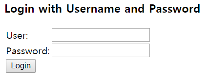

# Srping Security

web.xml

```xml
<context-param>
		<param-name>contextConfigLocation</param-name>
		<param-value>
			/WEB-INF/spring/root-context.xml
			/WEB-INF/spring/security-context.xml		//추가
		</param-value>
	</context-param>
...
<filter>
	<filter-name>springSecurityFilterChain</filter-name>
	<filter-class>org.springframework.web.filter.DelegatingFilterProxy</filter-class>
</filter>
<filter-mapping>
	<filter-name>springSecurityFilterChain</filter-name>
	<url-pattern>/*</url-pattern>
</filter-mapping>
...
```

security-context.xml

```xml
<http auto-config="true" use-expressions="true">
		<intercept-url pattern="/admin" access="hasRole('ADMIN')" />	
		<intercept-url pattern="/**" access="hasRole('USER')" />
</http>
<authentication-manager>
	<authentication-provider>
		<user-service>
			<user name="user1" password="password" authorities="ROLE_USER"/>
			<user name="admin" password="password" authorities="ROLE_ADMIN"/>
		</user-service>
	</authentication-provider>
</authentication-manager> 
```
기본적인 시큐리티 설정. 




```html
<table>
	<tr><td>User:</td><td><input type='text' name='username' value=''></td></tr>
	<tr><td>Password:</td><td><input type='password' name='password'/></td></tr>
	<tr><td colspan='2'><input name="submit" type="submit" value="Login"/></td></tr>
	<input name="_csrf" type="hidden" value="b6024d20-219d-483b-958a-c67d0ad693e5" /> //CSRF!
</table>
```

시큐리티가 권한 인증이 필요할 경우 시큐리티가 제공하는 기본 로그인 폼이 나온다.

CSRF공격을 막기 위해 input>hidden을 이용해 CSRF토큰을 발행한다.


인증을 하려고 하면 JSESSIONID 에 세션값이 부여가 된다.

이후 로그인에 성공하면 해당 세션 아이디가 서버의 해당하는 롤 리스트에 지정된다.(세션 정보를 쿠키 에디터로 바꾸었을 경우 다른 롤이 부여되는 것을 확인할 수 있었다.)


어노테이션 기반 설정

servlet-context.xml

```xml
<security:global-method-security secured-annotations="enabled" pre-post-annotations="enabled"/>	
```

```java
@Secured({ "ROLE_USER", "ROLE_ADMIN" })
	public String delete() {
		return "delete";
	}
```


