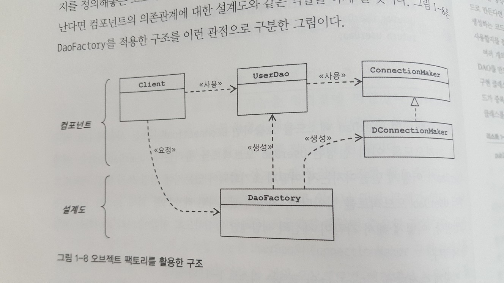
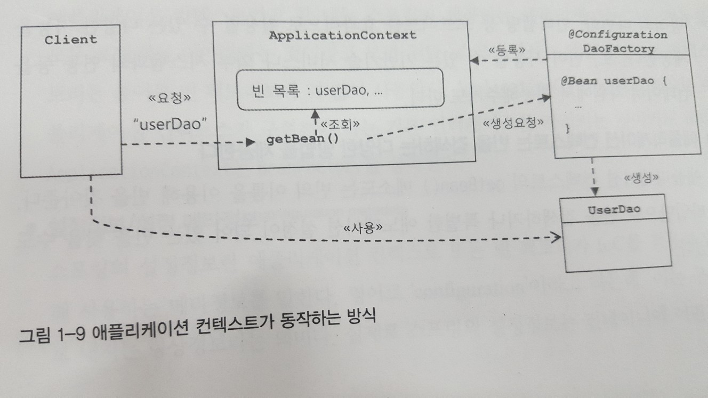

### 템플릿 메소드 패턴

슈퍼 클래스에 기본적인 로직의 흐름을 만들고, 그 기능의 일부를 추상 메소드나 오버라이딩이 가능한 protected 메소드 등으로 만든 뒤,  서브클래스에서 이런 메소드를 필요에 맞춰 구현하도록 하는 방법

### 팩토리 메소드 패턴

서브 클래스에서 구체적인 객체 생성 방법을 결정하게 하는 것

```java
//슈펴 클래스
public abstract class UserDao{
    public void add(User user) throws ClassNotFoundException, SQLException{
        //팩토리 메소드 패턴 - 하위 클래스에 정의된 객체를 반환 받는다.
        Connection c = getConnection();
            ...
    }
    public void get(String id) throws ClassNotFoundException, SQLException{
        Connection c = getConnection();
        ...
    }
    //템플릿 메소드 패턴 - 추상화할 기능의 일부
    // 서브클래스에서 구현할 부분
    public abstract Connection getConnection() throws ClassNotFoundException, SQLException;
}
//서브 클래스
public class NUserDao extends UserDao{
    //팩토리 메소드 패턴 - 서브 클래스에서 구체적인 객체 생성 방법을 결정하게 한다.
    public Connection getConnection() throws ClassNotFoundException, SQLException{
        //N사 DB connection 생성 코드
    }
}
//서브 클래스
public class DUserDao extends UserDao{
    //팩토리 메소드 패턴
    public Connection getConnection() throws ClassNotFoundException, SQLException{
        //D사 DB connection 생성 코드
    }
}
```

### 팩토리

객체의 생성 방법을 결정하고 그렇게 만들어진 오브젝트를 돌려준다. (디자인 패턴은 아니다.)

애플리케이션의 컴포넌트 역할을 하는 오브젝트와 애플리케이션의 구조를 결정하는 오브젝트를 분리할 수 있다.



```java
public class DaoFactory{
    public UserDao userDao(){
        ConnectionMaker connectionMaker = new DConnectionMaker();
        UserDao userDao = new UserDao(connectionMaker);
        return userDao;
    }
}
```

### 프레임워크 - IOC

프레임워크는 라이브러리의 다른 이름이 아니다. 프레임워크는 단지 미리 만든 반제품이 아니다. 확장해서 사용할 수 있는 준비된 추상 라이브러리가 아니다.

라이브러리를 사용하는 애플리케이션 코드는 애플리케이션 코드를 직접 제어한다. 반면, 프레임워크는 거꾸로 애플리케이션 코드가 프레임워크에 의해 사용된다.

프레임워크에는 분명한 제어의 역전 개념이 적용되어 있어야 한다


### ApplicationContext 예제

```java
@Configuration
public class DaoFactory {
	@Bean
	public UserDao userDao() {
		return new UserDao(connectionMaker());
	}
	
	@Bean
	public ConnectionMaker connectionMaker() {
		return new DConnectionMaker();
	}
}

public Class DaoTest{}
	public static void main(String[] args) throws ClassNotFoundException, SQLException {
        //애플리케이션 컨텍스트 생성
		ApplicationContext context = new AnnotationConfigApplicationContext(DaoFactory.class);
		UserDao dao = context.getBean("userDao",UserDao.class);
    }
}
```

.###ApplicationContext 동작 원리



#### 싱글톤 레지스트리로서의 애플리케이션 컨텍스트

스프링은 엔터프라이즈 시스템을 위한 기술이다. 따라서 대부분 서버 환경에서 실행된다.

대규모 엔터프라이즈 환경은 서버 하나당 초당 수십에서 수백번의 요청을 처리해야 했다. 따라서 요청이 올때만다 오브젝트를 새로 만드는 것은 큰 부담이 된다.

싱글톤으로 작성된 객체는 몇가지 제약조건이 있다. 객체는 상태정보를 가지지 않아야 한다. 왜냐하면 서버가 멀티 스레딩 환경에 작동하기 때문이다.