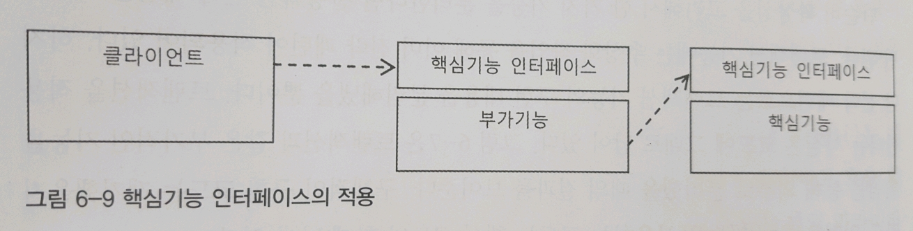
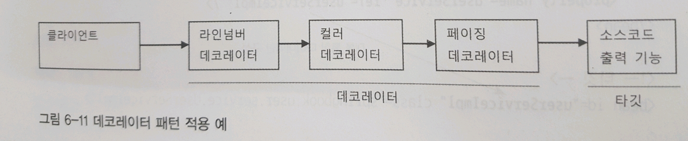

### 템플릿 메소드 패턴

슈퍼 클래스에 기본적인 로직의 흐름을 만들고, 그 기능의 일부를 추상 메소드나 오버라이딩이 가능한 protected 메소드 등으로 만든 뒤,  서브클래스에서 이런 메소드를 필요에 맞춰 구현하도록 하는 방법

### 팩토리 메소드 패턴

서브 클래스에서 구체적인 객체 생성 방법을 결정하게 하는 것

```java
//슈펴 클래스
public abstract class UserDao{
    public void add(User user) throws ClassNotFoundException, SQLException{
        //팩토리 메소드 패턴 - 하위 클래스에 정의된 객체를 반환 받는다.
        Connection c = getConnection();
            ...
    }
    public void get(String id) throws ClassNotFoundException, SQLException{
        Connection c = getConnection();
        ...
    }
    //템플릿 메소드 패턴 - 추상화할 기능의 일부
    // 서브클래스에서 구현할 부분
    public abstract Connection getConnection() throws ClassNotFoundException, SQLException;
}
//서브 클래스
public class NUserDao extends UserDao{
    //팩토리 메소드 패턴 - 서브 클래스에서 구체적인 객체 생성 방법을 결정하게 한다.
    public Connection getConnection() throws ClassNotFoundException, SQLException{
        //N사 DB connection 생성 코드
    }
}
//서브 클래스
public class DUserDao extends UserDao{
    //팩토리 메소드 패턴
    public Connection getConnection() throws ClassNotFoundException, SQLException{
        //D사 DB connection 생성 코드
    }
}
```

### 팩토리

객체의 생성 방법을 결정하고 그렇게 만들어진 오브젝트를 돌려준다. (디자인 패턴은 아니다.)

애플리케이션의 컴포넌트 역할을 하는 오브젝트와 애플리케이션의 구조를 결정하는 오브젝트를 분리할 수 있다.


```java
public class DaoFactory{
    public UserDao userDao(){
        ConnectionMaker connectionMaker = new DConnectionMaker();
        UserDao userDao = new UserDao(connectionMaker);
        return userDao;
    }
}
```

### 프레임워크 - IOC

프레임워크는 라이브러리의 다른 이름이 아니다. 프레임워크는 단지 미리 만든 반제품이 아니다. 확장해서 사용할 수 있는 준비된 추상 라이브러리가 아니다.

라이브러리를 사용하는 애플리케이션 코드는 애플리케이션 코드를 직접 제어한다. 반면, 프레임워크는 거꾸로 애플리케이션 코드가 프레임워크에 의해 사용된다.

프레임워크에는 분명한 제어의 역전 개념이 적용되어 있어야 한다


### ApplicationContext 예제

```java
@Configuration
public class DaoFactory {
	@Bean
	public UserDao userDao() {
		return new UserDao(connectionMaker());
	}
	
	@Bean
	public ConnectionMaker connectionMaker() {
		return new DConnectionMaker();
	}
}

public Class DaoTest{}
	public static void main(String[] args) throws ClassNotFoundException, SQLException {
        //애플리케이션 컨텍스트 생성
		ApplicationContext context = new AnnotationConfigApplicationContext(DaoFactory.class);
		UserDao dao = context.getBean("userDao",UserDao.class);
    }
}
```

.###ApplicationContext 동작 원리


#### 싱글톤 레지스트리로서의 애플리케이션 컨텍스트

스프링은 엔터프라이즈 시스템을 위한 기술이다. 따라서 대부분 서버 환경에서 실행된다.

대규모 엔터프라이즈 환경은 서버 하나당 초당 수십에서 수백번의 요청을 처리해야 했다. 따라서 요청이 올때만다 오브젝트를 새로 만드는 것은 큰 부담이 된다.

싱글톤으로 작성된 객체는 몇가지 제약조건이 있다. 객체는 상태정보를 가지지 않아야 한다. 왜냐하면 서버가 멀티 스레딩 환경에 작동하기 때문이다.


## 2장 테스트

* 테스트는 자동화돼야 하고, 빠르게 실행할 수 있어야 한다.
* main() 테스트 대신 JUnit 프레임워크를 이용한 테스트 작성이 편하다.
* 테스트 결과는 일관성이 있어야 한다. 코드의 변경 없니 환경이나 테스트 실행 순서에 따라서 결과가 달라지면안 된다.
* 테스트는 포괄적으로 작성해야 한다. 충분한 검증을 하지 않은 테스트는 없는 것보다 나쁠 수 있다.
* 코드 작성과 테스트 수행의 간격이 짧을수록 효과적이다
* 테스트하기 쉬운 코드가 좋은 코드다.
* 테스틀르 먼저 만들고 테스트를 성공시키는 코드를 만들어 가는 테스트 주도 개발 방법도 유용하다.
* 테스트 코드도 애플리케이션 코드와 마찬가지로 적절한 리펙토링이 필요하다
* @Before @After 를 사용해서 테스트 메소드들의 공통 준비 작업과 정리 작업을 처리할 수 있다.
* 스프링 테스트 컨텍스트 프레임워크를 이용하면 테스트 성능을 향상시킬 수 있다.
* 동일한 설정파일을 사용하는 테스트는 하나의 애플리케이션 컨택스트를 공유한다.
* @Autowired를 사용하면 컨택스트의 빈을 테스트 오브젝트에 DI할 수 있다.
* 기술 사용방법을 익히고 이해를 돕기 위해 학습 테스트를 작성하자
* 오류가 발견될 경우 그에 대한 버그 테스트를 만들어두면 유용하다.

### JUnit이 테스트를 수행하는 방식

> ```java
> import org.junit.runner.JUnitCore;
> //이건 어노테이션으로 자동화 된다. 단지 참고만 할것.
> public static void main(String[] args){
>     JUnitCore.main("springbook.user.dao.UserDaoTest");
> }
> ```

1. 테스트 클래스에서`@Test`가 붙은`public`  이고 `void`형이며 파라미터가 없는 테스트 메소드를 모두 찾는다.
2. 테스트 클래스의 오브젝트를 하나 만든다. 
1. `@Before`가 붙은 메소드가 있으면 실행한다.
2. `@Test`가 붙은 메소드를 하나 호출하고 테스트 결과를 저장해둔다.
3. `@After`가 붙은 메소드가 있으면 실행한다.
4. 나머지 테스트 메소드에 대해 2~5번을 반복한다.
7. 모든 테스트의 결과를 종합해서 돌려준다. 

* 테스트 메소드를 실행할 때마다 새로운 객체를 만든다. 이는 테스트의 독립성을 보장한다.
* 테스트를 위한 애플리케이션 컨택스트 관리 - 스프링 테스트 컨텍스트 프레임워크

```java
@RunWith(SpringJUnit4ClassRunner.class)
@ContextConfiguration(locations="/application-config.xml")
public class Test {
	@Autowired
	private ApplicationContext context;
```

##3장 템플릿

* JDBC와 같은 예외가 발생할 가능성이 있으며 공유 리소스의 반환이 필요한 코드는 반드시 try/catch/finally 블록으로 관리해야 한다.
* 일정한 작업 흐름이 반복되면서 그 중 일부 기능만 바뀌는 코드가 존재한다면 전략 패턴을 적용한다. 바뀌지 않는 부분은 컨텍스트로, 바뀌는 부분을 전략으로 만들고 인터페이스를 통해 유연하게 전략을 변경할 수 있도록 구성한다.
* 익명 내부 클래스 활용
* 코드를 이용해 직접 DI할 수도 있다.
* 템플릿/콜백 패턴
* 콜백에도 일정한 패턴이 반복된다면 콜백을 템플릿에 넣고 재활용하는 것이 편리하다.

### 템플릿/콜백 패턴

> 단일 전략 메소드를 갖는 전략 패턴이면서 익명 내부 클래스를 사용하여 매번 전략을 새로 만들어 사용하고, 컨텍스트 호출과 동시에 전략 DI를 수행하는 패턴

템플릿 add / 콜백 :익명 내부 클래스

```java
private JdbcContext jdbcContext;
public void add(final User user) throws ClassNotFoundException, SQLException {
		this.jdbcContext.workWithStatementStrategy(new StatementStrategy() {
			public PreparedStatement makePreparedStatement(Connection c) throws SQLException {
				PreparedStatement ps = c.prepareStatement("insert into users(id, name, password) values(?,?,?)");
				ps.setString(1, user.getId());
				ps.setString(2, user.getName());
				ps.setString(3, user.getPassword());

				return ps;
			}
		});
	}

```


## 4장 예외

## 5장 서비스 추상화

## 6장 AOP

### 프록시 패턴

마치 자신이 클라이언트가 사용하려는 실제 대상인 것처럼 위장해서 클라이언트의 요청을 받아주는 것을 **프록시**라고 한다 . 그리고 프록시를 통해 최종적으로 요청을 위임받아 처리하는 실체 오브잭트를 **타깃** 또는 **실체real subject** 라고 한다.

```java
public interface UserService {
	void upgradeLevels();
}
public class UserServiceImpl implements UserService {		//타깃, 실체
	public void upgradeLevels() {
		List<User> users = userDao.getAll();
		for (User user : users) {
			if (canUpgradeLevel(user)) {
				upgradeLevel(user);
			}
		}
	}
}
public class UserServiceTx implements UserService {	//프록시
    @Setter UserService UserService
	public void upgradeLevels() {
		TransactionStatus status = this.transactionManager	//부가기능
				.getTransaction(new DefaultTransactionDefinition());
		try {

			userService.upgradeLevels();	//실체 코드 실행

			this.transactionManager.commit(status);	//부가기능
		} catch (RuntimeException e) {
			this.transactionManager.rollback(status);
			throw e;
		}
	}
}
public class client{
    public static void main(String[] args){
        UserService userService = new UserServiceTx();	
        UserServiceTx.setUserService(new UserServiceImpl());
        userServiceTx.upgradeLevels();
    }
}
  
```



### 데코레이터 패턴

타깃에 부가적인 기능을 런타임 시 다이내믹하게 부여해주기 위해 프록시를 사용하는 패턴을 말한다.



### 리플렉션

리플렉션은 자바의 코드 자체를 추상화해서 접근하도록 만든 것이다.

```java
public class ReflectionTest {
	@Test
	public void invokeMethod() throws Exception{
		String name = "Spring";
		
        //length()
		assertThat(name.length(), is(6));
		
		Method lengthMethod = String.class.getMethod("length");
		assertThat((Integer)lengthMethod.invoke(name), is(6));
        
        //charAt()
        assertThat(name.charAt(0), is('S'));
        
        Method charAtMethod = String.class.getMethod("charAt". int.class);
        assertThat((Character)charAtMethod.invoke(name, 0), is('S'));
	}
}
```

### 다이나믹 프록시

다이나믹 프록시는 프록시 팩토리에 의해 런타임 시 다이나믹하게 만들어지는 오브젝트다. 

다이나믹 프록시가 인터페이스 구현 클래스의  오브젝트는 만들어 주지만, 프록시로부터 필요한 부가기능 제공 코드는 직접 작성해야 한다. 부가기능은 InvocationHandler를 구현한 오브젝트에 담는다. InvocationHandler인터페이스는 프록시 오브젝트와 독립적이다. InvocationHandler는 다음과 같은 메소드 한개만을 가진다.

> public Object invoke(Object proxy, Method method, Object[] args)

```java
interface Hello{
    String sayHello(String name);
    String sayHi(String name);
}
public class HelloTarget implements Hello{
    public String sayHello(String name){ return "Hello " + name; }
    public String sayHi(String name){ return "Hi " + name; }
                                        
}
//대문자로 바꾸는 부가기능 추가.
public class UppercaseHandler implemehts InvocationHandler{
    Hello target;
    
    public UppercaseHandler(Hello target){
        this.target = target;
    }
    @Override
    public Object invoke(Object proxy, Method method, Object[] args) throws Throwable{
         //타겟으로 위임, 인터페이스 메소드 호출에 모두 적용된다.
        String ret = (String)method.invoke(target, args);
        if(ret instanceof String && method.getName().startsWith("say")){ //선별적 기능
            return ret.toUpperCase(); //부가기능
        } else{
            return ret;
        }      
    }
    
}
Class Client{
    public static void main(String[] args) {
		Hello proxiedHello = (Hello)Proxy.newProxyInstance(
        	getClass().getClassLoader(),
        	new Class[]{Hello.class},	//구현할 인터페이스
        	new UppercaseHandler( new HelloTarget() ) ); //부가기능을 담은 InvocationHandler
        
        proxiedHello.sayHello();
        proxiedHello.sayHi();
	}
}
```

#### 프록시 팩토리 빈 - 포인트컷

> 어드바이저 = 포인트컷(메소드 선정 알고리즘) + 어드바이스(부가기능)

```java
@Test
public void Client(){
    ProxyFactoryBean pfBean = new ProxyFactoryBean();
    pfBean.setTarget(new HelloTarget());
    //포인트컷
    NameMatchMethodPointcut pointcut = new NameMatchMethodPointcut();
    pointcut.setMappedName("sayH*");
    //어드바이스, 포인트컷과 조합해서 등록한다.
    pfBean.addAdvisor(new DefaultPointcutAdvisor(pointcut, new UppercaseAdvice()));
    
    Hello proxiedHello = (Hello) pfBean.getObject();    
}
```

#### aop네임스페이스

```java
<aop:config>
		<aop:advisor advice-ref="transactionAdvice" pointcut="execution(* *..*ServiceImpl.upgrade*(..))"/>
	</aop:config>
```


### 애스펙트 지향 프로그래밍(AOP : Aspect Oriented Programing)

애플리케이션의 핵심적인 기능에서 부가적인 기능을 분리해서 애스펙트라는 독특한 모듈로 만들어서 설계하고 개발하는 방법

#### 용어

* 타깃 : 부가기능을 부여할 대상
* 어드바이스 : 타깃에게 제공할 부가기능을 담은 모듈
* 조인 포인트 : 어드바이스가 적용될 수 있는 위치
* 포인트컷 : 조인포인트를 선별하는 작업
* 프록시 : 클라이언트와 타깃 사이에 투명하게 존재하면서 부가기능을 제공하는 오브젝트
* 어드바이저 : 포인트컷과 어드바이스를 하나씩 갖고 있는 오브젝트
* 에스팩트 : OOP의 클래스와 마찬가지로 AOP의 기본 모듈이다.


### 트랜잭션 정의

#### 트랜잭션 전파

트랜잭션의 경계에서 이미 진행중인 트랜잭션이 있을 때 또는 없을 때 어떻게 동작할 것인지 결정하는 방법

* PROPAGATION_REQUIRED : 진행중인 트랜잭션이 없으면 새로 시작하고, 이미 시작된 트랜잭션이 있으면 참여한다.
* PROPAGATION_REQUIRES_NEW : 항상 새로운 트랜잭션을 시작한다.
* PROPAGATION_NOT_SUPPORTED : 트랜잭션 없이 동작하도록 만든다.

#### 격리수준

#### 제한시간

#### 읽기전용

트랜잭션 네에서 데이터를 조작하려는 시도를ㄹ 막아줄 수 있다. 성능 향상도 기대할 수 있다.


